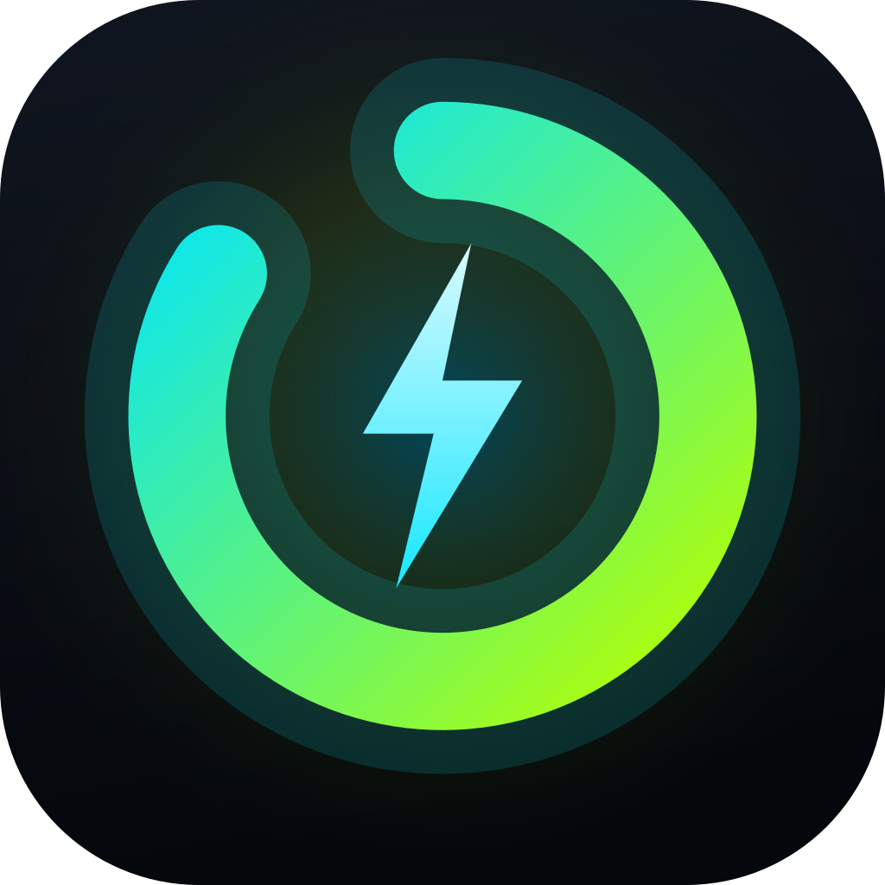
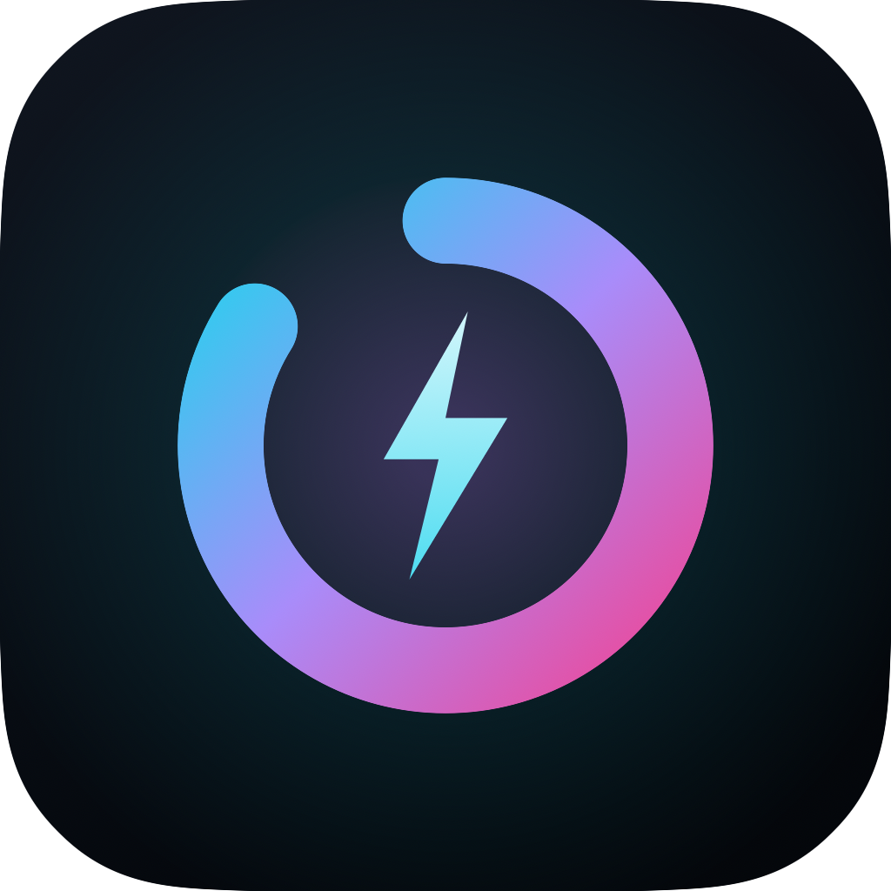
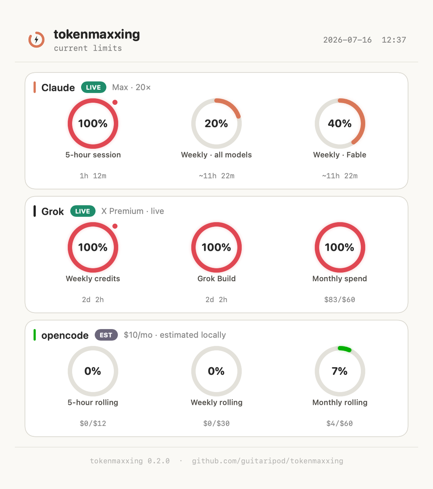
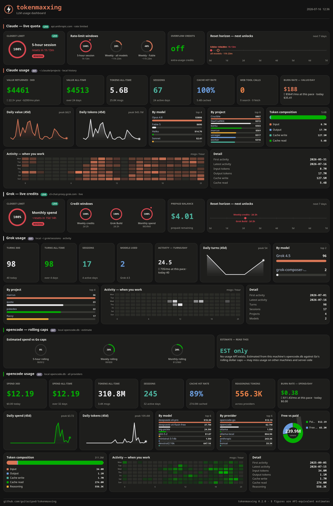
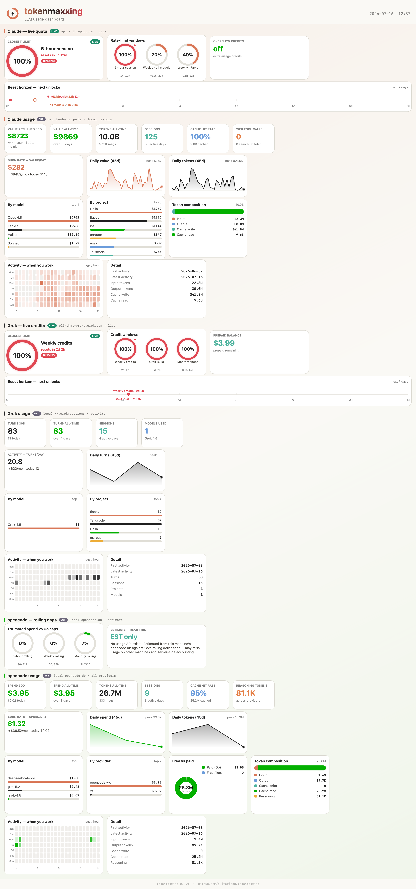

# tokenmaxxing

<p align="left">
  
  &nbsp;
  
</p>

Native desktop **usage dashboards** for your LLM subscriptions — live quota, local history, and a value-for-money readout. One product, two platform builds:

| **KDE build** (Rust · GTK4 · libadwaita) | **macOS build** (SwiftUI · Liquid Glass) |
| --- | --- |
| System tray · compact limits + full dashboard | Menu bar · compact limits + full dashboard |
|  |  |

Full analytics dashboards (same data, both platforms):

| KDE | macOS |
| --- | --- |
|  |  |

Both render the same quota model for three subscriptions, in order:

- **Claude** (Anthropic Max / Pro) — **live**, from the same OAuth usage endpoint Claude Code's `/usage` uses.
- **Grok** (Grok Build / SuperGrok) — **live**, from the same billing endpoint the Grok CLI's `/usage` uses.
- **opencode go** (OpenCode's $10/mo plan) — **estimated locally** (see the honesty note below).

Each quota *window* gets its own ring gauge (5-hour session, weekly credits, per-product, rolling spend caps…), coloured by headroom and by brand-matched accents — Claude terracotta, Grok monochrome, opencode green.

## The opencode-go honesty note

OpenCode Go's quota is a set of **rolling dollar spend caps** (~$12 / 5h, ~$30 / week, ~$60 / month) enforced server-side. There is **no public API** to read the remaining amount — it's only visible in the web console at [opencode.ai/auth](https://opencode.ai/auth) behind a GitHub login.

So both builds **estimate** it by summing this machine's spend from the local `opencode.db` against those caps, and label the card **EST** with a plain-language disclaimer. The estimate can under-count usage from other machines and won't match server-side accounting exactly. Claude and Grok numbers, by contrast, are genuinely live. See [docs/data-sources.md](docs/data-sources.md) for the full breakdown.

## Features (both builds)

- **Live quota, one ring per window** — 5-hour session, weekly credits, per-model/product, overflow credits — coloured by headroom and by the API's *own* severity, with the **binding constraint** called out as the hero.
- **Compact limits view** — Claude → Grok → opencode as dense cards; KDE pins it **570×730 bottom-right** of the monitor.
- **Claude 429 resilience** — last-good reading cached to disk; ≥5 min cooldown after rate limits so rings stay on screen instead of blanking.
- **Light & dark mode** — follows the system preference on both platforms.
- **Brand-matched palette** — Anthropic terracotta, xAI monochrome, opencode green, on Anthropic-aligned surfaces.
- **Reset horizon** — upcoming resets across providers on one soonest-first timeline.
- **Full usage history** from local files — daily cost/token (or turn) charts, per-model / per-project / per-provider breakdowns, token composition where available, cache hit rate, and an hour-of-week activity heatmap. Grok history is activity-only (the CLI does not store per-turn tokens).
- **Value returned** — what your subscription would have cost on the metered API (an estimate; the tokens are exact), plus a burn-rate/month projection.
- **Screenshot utility** — mini window camera (WYSIWYG + subtle credit line), full dashboard panel picker, or headless `--export`. PNGs go to Pictures **and** the clipboard (`wl-copy` on KDE Wayland).
- **Fullscreen-capable dashboard** that reflows from ~1000px to 4K, resident in the tray / menu bar.

## Layout

```
tokenmaxxing/
├── tokenmaxxing-kde/     Rust GTK4 build for KDE Plasma 6
├── tokenmaxxing-macos/   SwiftUI menu-bar build for macOS 26+
├── docs/                 data-sources.md, model.md
└── assets/               compact limits + full dashboard share renders
```

## Build

- **KDE** — [`tokenmaxxing-kde/README.md`](tokenmaxxing-kde/README.md) (`cargo build --release`)
- **macOS** — [`tokenmaxxing-macos/README.md`](tokenmaxxing-macos/README.md) (`make run`, needs macOS 26 + Xcode 26)

## License

GPL-3.0-or-later — see [LICENSE](LICENSE).
