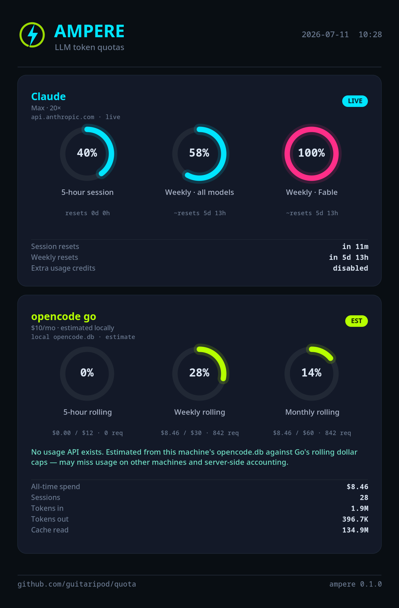
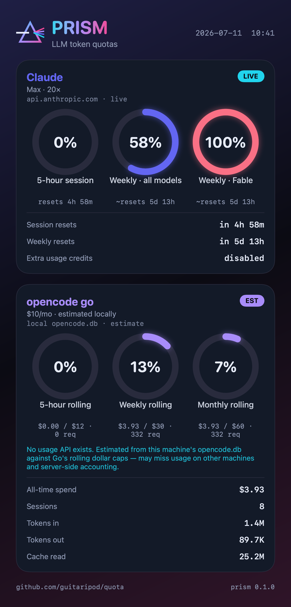

# quota

Two native desktop meters for your LLM subscription token quotas — one for **KDE Plasma**, one for **macOS** — with deliberately distinct identities.

| **Ampere** — KDE Plasma (Rust · GTK4 · libadwaita) | **Prism** — macOS (SwiftUI · Liquid Glass) |
| --- | --- |
| Electric / terminal. Lives in the system tray. | Iridescent glass. Lives in the menu bar. |
|  |  |

Both render the same quota model for two subscriptions:

- **Claude** (Anthropic Max / Pro) — **live**, from the same OAuth usage endpoint Claude Code's `/usage` uses.
- **opencode go** (OpenCode's $10/mo plan) — **estimated locally** (see the honesty note below).

Each quota *window* gets its own ring gauge (5-hour session, weekly, per-model weekly, rolling spend caps…), colored by headroom — accent while healthy, amber past 60%, hot past 85%.

## The opencode-go honesty note

OpenCode Go's quota is a set of **rolling dollar spend caps** (~$12 / 5h, ~$30 / week, ~$60 / month) enforced server-side. There is **no public API** to read the remaining amount — it's only visible in the web console at [opencode.ai/auth](https://opencode.ai/auth) behind a GitHub login.

So both apps **estimate** it by summing this machine's spend from the local `opencode.db` against those caps, and label the card **EST** with a plain-language disclaimer. The estimate can under-count usage from other machines and won't match server-side accounting exactly. Claude's numbers, by contrast, are genuinely live. See [docs/data-sources.md](docs/data-sources.md) for the full breakdown, including how a live opencode reading could be wired if the account token is provided.

## Features (both apps)

- **One ring per quota window** — every variable is visualized, never collapsed into a single number.
- **Full detail block** — token totals, session counts, reset times, plan tier, data source, and live/estimated/offline state.
- **Interface-scale selector** — resize the entire UI (100%–200%).
- **Share-card export** — a purpose-drawn, high-resolution PNG for sharing (also available headless via `--export`).
- **Tray / menu-bar resident** with refresh, settings, and quit.

## Layout

```
quota/
├── ampere-kde/    Rust GTK4 app for KDE Plasma 6
├── prism-macos/   SwiftUI menu-bar app for macOS 26+
├── docs/          data-sources.md, model.md
└── assets/        share-card renders
```

## Build

- **Ampere** — [`ampere-kde/README.md`](ampere-kde/README.md) (`cargo build --release`)
- **Prism** — [`prism-macos/README.md`](prism-macos/README.md) (`make run`, needs macOS 26 + Xcode 26)

## License

MIT — see [LICENSE](LICENSE).
