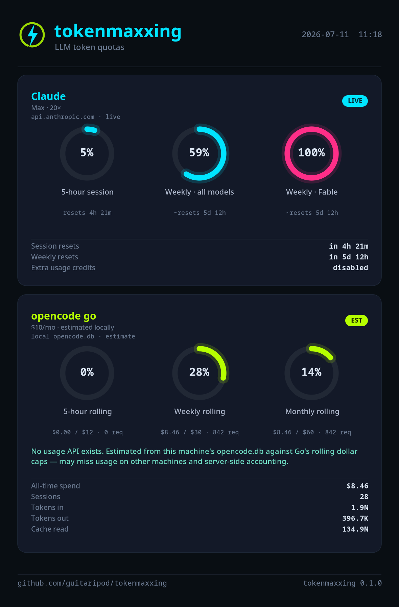

# tokenmaxxing — KDE build

LLM-usage **dashboard** for **KDE Plasma**. Rust · GTK4 · libadwaita · Cairo. The whole dashboard is drawn on one Cairo canvas, so a screenshot is pixel-for-pixel the live view.



## Requirements

System libraries (Arch package names): `gtk4` (≥ 4.12), `libadwaita`, plus a Rust toolchain. The tray needs a StatusNotifierItem host — standard on Plasma 6. Optional: `wl-copy` for reliable clipboard screenshots on Wayland. A `rust-toolchain.toml` pins **stable**.

## Build & run

```sh
cargo build --release
./target/release/tokenmaxxing
# or
bash resources/install.sh   # binary + icons + .desktop into ~/.local
```

User systemd unit (optional): `~/.config/systemd/user/tokenmaxxing.service` with `Restart=on-failure` (not `always` — GApplication secondary launches exit 0).

It installs a tray icon. Left-click toggles the **compact limits window** (fixed **570×730**, always bottom-right of the current monitor via KWin). **Full dashboard** opens from the header. Closing either window hides to the tray when a tray host is available. Light/dark follows the system theme.

## Screenshot / share export

- **Mini window 📷** — one-shot WYSIWYG of the limits view, plus a subtle `tokenmaxxing <version> · github.com/guitaripod/tokenmaxxing` credit line. Written to Pictures and **copied to the clipboard**.
- **Full dashboard 📷** — panel-picker mode, then export selected or everything.
- **Headless:**

```sh
tokenmaxxing --export [path.png]          # full dashboard
tokenmaxxing --export-limits [path.png]   # compact limits view
```

## Data

- **Claude** — live quota from `~/.claude/.credentials.json`, plus usage history from `~/.claude/projects/**/*.jsonl`. Last-good usage body cached under `~/.config/tokenmaxxing/claude_usage_cache.json` for 429 resilience (see [../docs/data-sources.md](../docs/data-sources.md)).
- **Grok** — live credits from `~/.grok/auth.json` via `cli-chat-proxy.grok.com/v1/billing`, plus activity history from `~/.grok/sessions`.
- **opencode** — estimated caps and all-provider history from `~/.local/share/opencode/opencode.db`, opened read-only. Labeled **EST**.

## Config

`~/.config/tokenmaxxing/config.json` — `{ "ui_scale": 1.25, "dashboard_width": …, "dashboard_height": … }`. Interface scale is set from the full dashboard ☰ menu (100%–200%). Mini window size is fixed.
